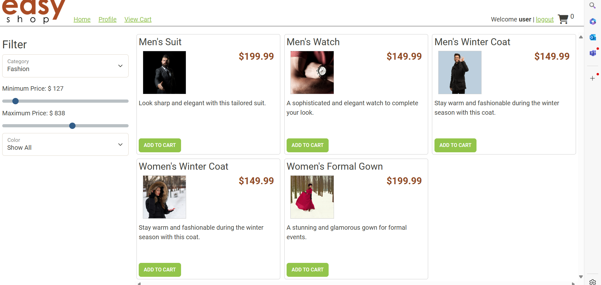
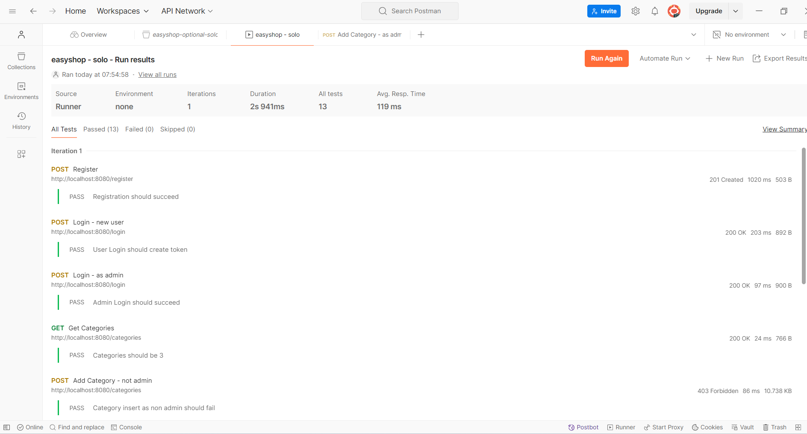
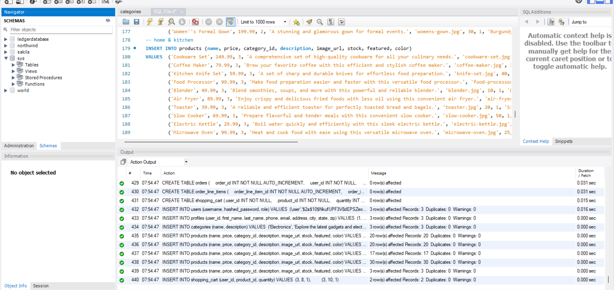

# Project Title
The Project Title is EasyShop. 

## Description of the Project
The website offers login capabilities for both administrators and regular users. Additionally, it provides customizable
filters for browsing products, ensuring convenient display of prices and images. 

## User Stories
List the user stories that guided the development of your application. Format these stories as: "As a [type of user], I want [some goal] so that [some reason]."
- As a user, I want to be able to input my data, so that the application can process it accordingly.
- As a user, I want to receive immediate feedback, so I can understand what to do next.
### Prerequisites

To install this application, use IntelliJ along with MySQL Workbench. Follow the provided link and select an installation 
method from the <> Code dropdown. Clone the repository locally and open it in IntelliJ. Locate the database folder within 
the project directory. In MySQL Workbench, log in as root, open a new SQL tab, paste the copied database script, and execute
it to create a new schema. Configure IntelliJ to connect to MySQL Workbench using a profile that grants limited access to 
users and full administrative access to admins. Update the application.properties file in the resources directory with your
MySQL Workbench credentials. Finally, open the Capstone-client-web-application project in another IntelliJ window.

### Running the Application in IntelliJ
Follow these steps to get your application running within IntelliJ IDEA:
1. Open IntelliJ IDEA.
2. Select "Open" and navigate to the directory where you cloned or downloaded the project.
3. After the project opens, wait for IntelliJ to index the files and set up the project.
4. Find the main class with the `public static void main(String[] args)` method.
5. Right-click on the file and select 'Run 'YourMainClassName.main()'' to start the application.

## Technologies Used
-The application framework uses variety of technologies and tools, including:

Java as the primary programming language.
Spring Boot - for building and deploying Java-based applications.
MySQL as the database management system for storing data.
Postman, an API testing tool used for debugging and testing RESTful APIs.
Git for version control, facilitating collaborative code management.

IntelliJ IDEA: Ensure you have IntelliJ IDEA installed, which you can download from [here](https://www.jetbrains.com/idea/download/).
Java SDK: Make sure Java SDK is installed and configured in IntelliJ.

## Demo

## Future Work
Outline potential future enhancements or functionalities you might consider adding:
-  Implement a rating and review system for the products.
- Work on Shopping Cart and have the checkout function.
## Resources
List resources such as tutorials, articles, or documentation that helped you during the project.
- https://github.com/RayMaroun/yearup-spring-section-6-2024/tree/main/pluralsight/java-development/workbook-9/NorthwindTradersAPI6

## Thanks
Express gratitude towards those who provided help, guidance, or resources:
- Thank you to Raymond for continuous support and guidance.
- A special thanks to all teammates for their dedication and teamwork.